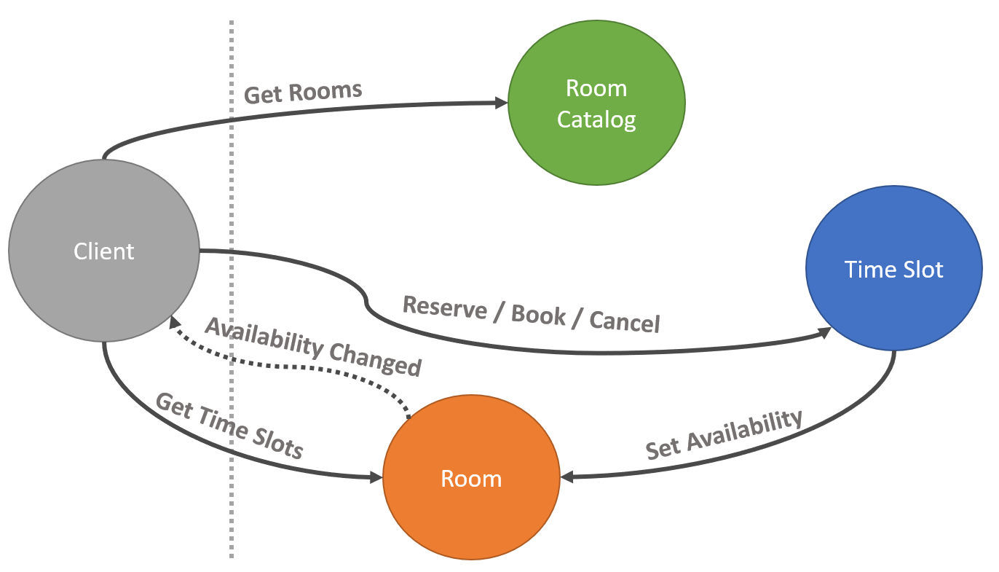

# Booking system - Orleans Demo

A simple implementation of a booking system using [Orleans](https://github.com/dotnet/orleans).

The system consists of three applications:
1. [Booking.Web](src/Booking.Web/), a Blazor Server application, which can be accessed at https://booking-web.jollysmoke-78d41806.westeurope.azurecontainerapps.io/
2. [Booking.Admin](src/Booking.Admin/), a Blazor Server application, which can be accessed at https://booking-admin.jollysmoke-78d41806.westeurope.azurecontainerapps.io/ (currently blocked behind AAD login)
3. [Booking.Silo](src/Booking.Silo/), a Orleans silo, which includes [Orleans Dashboard](https://github.com/OrleansContrib/OrleansDashboard), which can be accessed at https://booking-silo.jollysmoke-78d41806.westeurope.azurecontainerapps.io/

In addition to this, traces can examined using [TraceLens](https://github.com/asynkron/TraceLens) at https://tracelens-ui.jollysmoke-78d41806.westeurope.azurecontainerapps.io/

The system runs on [Azure Container Apps](https://learn.microsoft.com/azure/container-apps/) and [Bicep](https://learn.microsoft.com/azure/azure-resource-manager/bicep/) files for the infrastructure can be find in [infra](infra).

## Overview

* There's a [room catalog](src/Booking.Abstractions/IRoomCatalogGrain.cs) (a single grain), from where a list of rooms can be fetched. For convenience, Booking.Admin contains a view for adding and deleting rooms.
  * Be aware that this design might cause bottlenecks, since we have a single grain that every client will call. If this design is used, it would probably be wise to replicate the data, for faster reads, on each silo using e.g. [Stateless workers grains](https://learn.microsoft.com/en-us/dotnet/orleans/grains/stateless-worker-grains).
  * In others scenarios, this data would probably come from a source outside the system and only be cached here. That could be done using e.g. [Stateless workers grains](https://learn.microsoft.com/en-us/dotnet/orleans/grains/stateless-worker-grains) in order to have it in-memory on every silo.
* For each room, there's a [room grain](src/Booking.Abstractions/IRoomGrain.cs), where a list of [timeslots](src/Booking.Abstractions/TimeSlot.cs) per day can be fetched.
  * For convenience, the timeslots are created on-the-fly, but in own real-world scenarios this data might be fetched from outside the system and only cached here.
* When booking a [time-slot](src/Booking.Abstractions/ITimeSlotGrain.cs), user first need to reserve the time-slot, and happens automatically by clicking a row in the web application. This is mainly used avoid double booking, and to keep the time-slot reserved while the user enters additional information.
  * In this demo, there's no additional information to add, but in a real-world scenario there might be.
* When user manages to create a reservation, a [Timer](https://learn.microsoft.com/en-us/dotnet/orleans/grains/timers-and-reminders#timers) is then created to automatically cancel the reservation if a booking is not done within a reasonable time.
  * In the demo, a [Reminder](https://learn.microsoft.com/en-us/dotnet/orleans/grains/timers-and-reminders#reminders) would probably be sufficient. In real-world scenarios, the reservation time can be much longer, so something persisted is preferred.
  * Additionally, when a reservation is done, the visibility of the time-slot is updated in the room grain, which marks it as "not available" when listing time-slots form the room grain.
* When user does the actual booking, the timer in the previous step is removed, meaning the time-slot will be marked as "not available" for eternity.
  * In a real-world scenario, a call to the outside system (database) would be done here to make the actual booking. 
* There's also possibility of manually cancelling the reservation, which also removes the timer, and updates the availability on the room grain.

In order to provide real-time updates to the end-user, following [Observers](https://learn.microsoft.com/en-us/dotnet/orleans/grains/observers) are present:
* [Reservation observer](src/Booking.Abstractions/IReservationObserver.cs). This is passed when making a reservation, and is used by the [time-slot](src/Booking.Silo/Grains/TimeSlotGrain.cs) to notify the client that the reservation has expired.
  * This is probably not necessary, but I added it anyway 🙂
* [Room observer](src/Booking.Abstractions/IRoomObserver.cs). This is used to subscribe to updates on time-slot availabilities on a specific [room](src/Booking.Silo/Grains/RoomGrain.cs). When a time-slot is reserved, the client can automatically render the slot as not available, and when a reservation is cancelled the client can automatically render the slot as available.